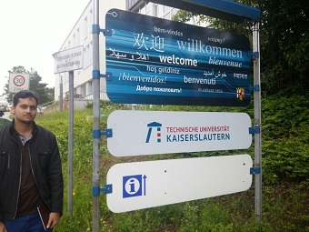
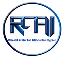
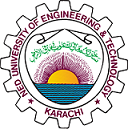
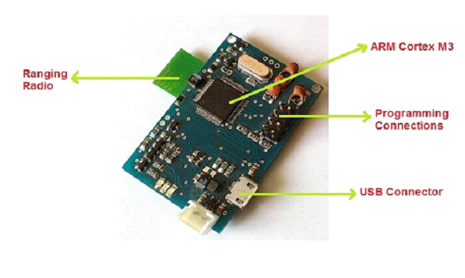
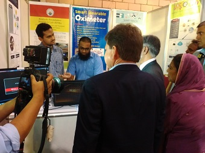

I am Muhammad Yaseen, currently working as a Machine Learning Engineer at [Gaditek](http://www.gaditek.com) - a Cyber Security company. I did my Bachelors in Computer and Information Systems Engineering from NED University of Engineering and Technology, Pakistan.

## Research Interests

My chief interest is in designing intelligent systems that are capable of learning and adaptation. I study algorithms that learn from structured and unstructured data, environment, labeled examples, expert behavior in an attempt to act in an artificially intelligent way. I have also worked on developing Big Data and ML pipelines and software infrastructure for Machine Learning.

----------------|-----------------------------
Research Areas  | <button class="skill-badge-green">Artificial Intelligence</button> <button class="skill-badge-green">Machine Learning</button> <button class="skill-badge-green">Deep Learning</button>

#### Skills Summary

----------------|-----------------------------
Programming     | <button class="skill-badge-blue">Python</button> <button class="skill-badge-blue">C/C++</button> <button class="skill-badge-blue">Java</button> <button class="skill-badge-blue">C#</button> <button class="skill-badge-blue">PHP</button> <button class="skill-badge-blue">VCS (Git)</button>
ML/DL Frameworks      | <button class="skill-badge-blue">Keras</button> <button class="skill-badge-blue">Tensorflow</button> <button class="skill-badge-blue">SciKit</button> <button class="skill-badge-blue">Spark MLLib</button>
Big Data        | <button class="skill-badge-blue">Apache Hadoop</button> <button class="skill-badge-blue">Apache Spark</button> <button class="skill-badge-blue">Apache Flume</button> <button class="skill-badge-blue">Apache Hive</button>
Linux        | <button class="skill-badge-blue">CentOS</button> <button class="skill-badge-blue">Ubuntu</button> <button class="skill-badge-blue">LinuxMint</button>

## Research Experience
### TU Kaiserslautern / German Research Center for AI, Kaiserslautern, Germany

Research Intern (June 2016 - August 2016)

---
In German, Deutsches Forschungszentrum für Künstliche Intelligenz

Internship supervisors:
- Dr. Prof. h.c. Andreas Dengel ([TU KL](http://agd.informatik.uni-kl.de/team/lehre/prof-dr-prof-hc-andreas-dengel/) / [DFKI](https://www.dfki.de/web/kontakt/mitarbeiter?uid=ande00) / [Google Scholar](https://scholar.google.com/citations?user=p3YP0DMAAAAJ&hl=en))
- Dr-Ing. Syed Saqib Bukhari ([TU KL](http://agd.informatik.uni-kl.de/team/lehre/dr-saquib-bukhari/) / [DFKI](http://dfki.de/~bukhari/) / [Google Scholar](https://scholar.google.com/citations?user=q3ecbfMAAAAJ&hl=en))

This internship was part of Smart Agriculture project collaboration between NED University (Pakistan) and DFKI (Germany). During this internship I learned how AI and ML is being used at DFKI to solve many different problems in fields like agriculture, farming, smart books/learning, document understanding and segmentation.

As part of my project study, I gave following 2 presentations:

[Commercial and Research Landscape for Smart Irrigation Systems](https://www.slideshare.net/MuhammadYaseenAftab1/commercial-research-landscape-for-smart-irrigation-systems) - Presented as part of an initial project study at DFKI.

[Smart Irrigation Systems - Hardware Architecture](https://www.slideshare.net/MuhammadYaseenAftab1/smart-irrigation-system-hardware-architecture-for-warm-project) - A presentation I gave at 10th Workshop on Field and Assistive Robotics [(WFAR 10)](https://agrosy.informatik.uni-kl.de/en/conferences/wfar/wfar10/) at Schloss Dagstuhl in Wadern, Germany.

### Research Center for AI, NED University

Research Student (June 2015 - December 2016)

---

Supervisor: Dr. Muhammad Khurram ([NED UET](http://www.neduet.edu.pk/cise/mkhurram.html) / [RCAI](http://rcai.pk/ResearchCenterAI/ourteam/director.html))

I was among the first members of newly formed RCAI established at NED University. At RCAI I worked mainly on projects leveraging the Internet of Things (IoT) technology.

* **Smart Agriculture** [(Project Link)](http://rcai.pk/ResearchCenterAI/project/pp1.html): In this German Academic Exchange Service (DAAD) funded project, as part of hardware design team I worked on several prototypes based on different Arduino and custom boards. (weblink)
* **Smart Warehouse** [(Project Link)](http://rcai.pk/ResearchCenterAI/project/p4.html): In this project I worked on a device which helps warehouse workers avoid accidental injury-causing encounters with automated heavy-machinery and tools. My work included writing code **C/C++** for hardware interfacing.

[Blog Post](https://yaseenx.wordpress.com/2016/06/11/presenting-my-paper-at-1st-ieec-conference/) about project

Project presentation: [A Smart Safety Gadget for Avoiding Accidents in Warehouse Environment](https://www.slideshare.net/MuhammadYaseenAftab1/a-smart-safety-gadget-for-avoiding-accidents-in-warehouse-environment)

* **Oximeter** [(Project Link)](http://rcai.pk/ResearchCenterAI/project/p8.html): In this project I worked on a Bluetooth enabled low-power oximeter which measures blood-oxygen level and heart rate. My responsibilities included writing code in **C/C++** for interfacing the hardware components. I also developed an Android app **Java** for operating device via smartphone.

## Work Experience

### PureVPN (via Disrupt Ventures)

Machine Learning Engineer (December 2016 - Present)

---
Achievements:

* Deployment of company's first Apache Spark cluster
* Deployment of company's first Apache Hadoop cluster
* Architecting company's first Machine Learning pipeline

Problems I have worked with:

* Customer churn
Identifying the reasons of churn
Support marketing teams in designing targeted campaigns based on data driven insights
Predict customers that are more likely to churn
A consistent and company-wide accepted measure of churn.

* Infrastructure health, and capacity planning
In this project I worked on development and deployment of data ingestion and storage pipeline. Collection and robust, scalable storage of machine generated metrics of a global network. The data was then used for monitoring the health of global IT infrastructure. Aid in scheduled load and capacity planning. This also reduced the manual effort of gathering data and compiling hefty reports, and increased accuracy and visibility.

### Electronics Design Center, NED University

Research Student (January 2015 - April 2015)

---

Smart Doorbell

In Electronics Design Center I was responsible for:  

* Hardware-Software interfacing, testing, and debugging.
* Software development for Embedded Systems  

### Hyphen Consultancy

Freelance Remote Web Developer (August 2012 - October 2014)

---

As a freelancer with Hyphen Consultancy I worked on:  
Database driven Web Applications (Primarily PHP and MySQL, occasionally ASP.Net and MS SQL Server)
Rich Internet Applications using Google Web Toolkit (Java)

## Online Courses and Certifications

I did following online courses to enhance my knowledge of Machine Learning and data analytics platforms

|-------------------
|Neural Networks and Deep Learning 
|Improving Deep Neural Networks 
|Machine Learning by Andrew Ng 
|Bayesian Statistics: From Concepts to Data Analysis 
|Deep Learning: RNN in Python 
|Intodcution to Mathematical Thinking 
|Artificial Intelligence: Reinforcement Learning in Python 
|Hadoop Platform and Application Framework 
|Taming Big Data with Apache Spark and Python 
|Complete Guide to Elasticsearch 

## Scholarships, Honors, and Awards

|-------------------------------------------------------
| 7th Position out of 140 in the graduating batch (top 5%)
| Won National ICT R&D Fund award for Final Year Project
| Among top 10 in European Space Agency's [Mars Express Power Challenge](https://kelvins.esa.int/mars-express-power-challenge/leaderboard/)
| 2nd Position at DICE Health Exhibition and Competition 2015
| Won Scholarship awarded by Hamdard Foundation for University studies, 2013-2017
| Certificate of Merit awarded by the Principal of Adamjee Government Science College.
| Won Scholarship awarded by Hamdard Foundation for College studies, 2011-2012
| Cash Prize by Board of Secondary Education, Karachi (12th Position in city).

## Opensource Contribution

* [Apache Flume Plugins](https://github.com/muhammadyaseen/flume-plugins) - (author)
* [Awesome Machine Learning](https://github.com/josephmisiti/awesome-machine-learning) - (contributor)

## I have programming experience in:

* Python, Java, C/C++, C#
* PHP, ASP.Net MVC, HTML, CSS, and jQuery
* Version Control Systems e.g. Git
* Linux OS (CentOS, Linux Mint, and Ubuntu)

## Machine Learning Tools I have worked with

* Keras, Tensorflow, SciKit, Spark MLLib

## Big Data Tools I have worked with

* Apache Hadoop, Apache Spark, Apache Flume
* Elasticsearch and Kibana

## Other Interests

* History (Contemporary, Medieval, Antiquity)
* Philosophy
* Amateur Astronomy, [Astronomy Society](https://www.facebook.com/KarachiAstronomy/)
* Literature, Reading ([2016](https://yaseenx.wordpress.com/2017/01/21/what-i-read-in-2016/), [2017](https://yaseenx.wordpress.com/2018/02/11/what-i-read-in-2017/)), Writing ([Blog](http://yaseenx.wordpress.com))

<a name="contact" />
## Contact

* mohammad_yaseen13@live.com
* [@nisaydhm](twitter.com/nisaydhm)
